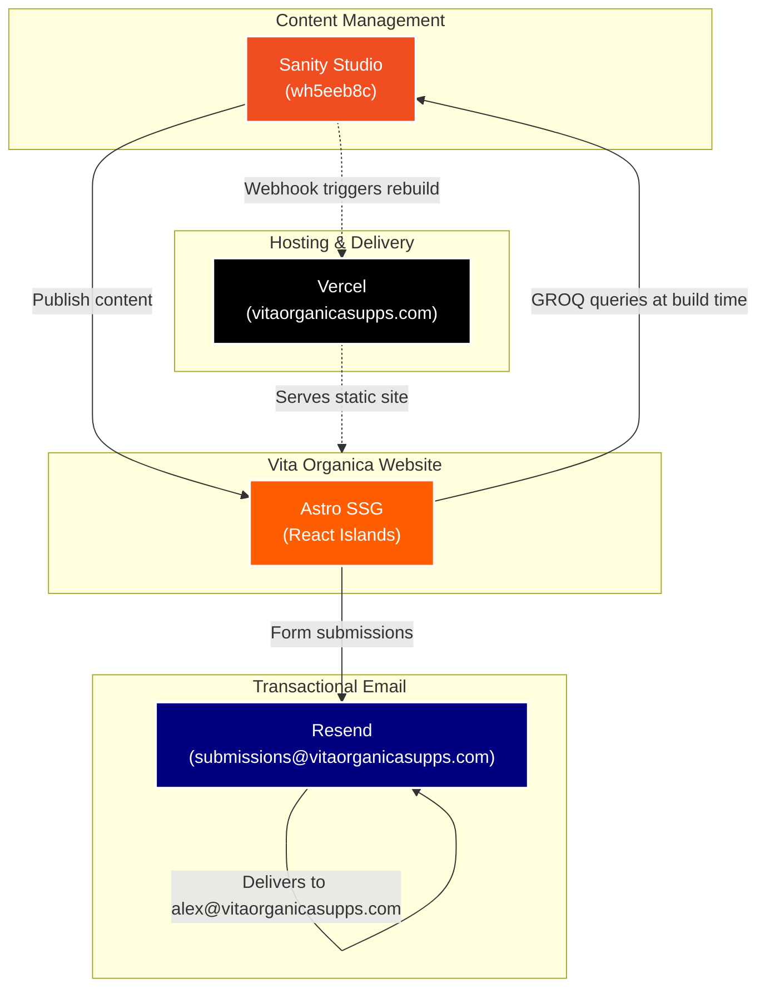

# Vita Organica — Site Architecture

## System Overview

---

## Tech Stack

| Layer | Technology | Purpose |
|---|---|---|
| Framework | Astro v5 | Static site generation, routing, SSR API routes |
| UI Components | React v19 | Interactive sections (mockup tool, lead forms) |
| Styling | Vanilla CSS + CSS Variables | Design system, no Tailwind |
| Icons | Lucide React | UI icons |
| CMS | Sanity | Blog posts and content management |
| Email | Resend | All form submission delivery |
| Hosting | Vercel | CI/CD, CDN, serverless API routes |

---

## How Deployments Work

1. A developer pushes code to the `main` branch on GitHub
2. Vercel detects the push and automatically builds and deploys the site
3. The live site at `vitaorganicasupps.com` is updated within ~2 minutes

When content is published in Sanity:
1. Sanity fires a webhook to Vercel
2. Vercel triggers a new build to pull in the latest content
3. The site rebuilds automatically — no developer action needed

---

## Page Routes

| URL | Description |
|---|---|
| `/` | Homepage |
| `/manufacturing` | All manufacturing capabilities overview |
| `/manufacturing/capsules` | Capsule format page |
| `/manufacturing/gummies` | Gummies format page |
| `/manufacturing/powders` | Powder format page |
| `/manufacturing/soft-gels` | Soft gel format page |
| `/manufacturing/gel` | Gel format page |
| `/manufacturing/spoons` | Sachet formats page |
| `/private-label` | Private label services |
| `/packaging-design` | Packaging & design services |
| `/about` | About page |
| `/blog` | Blog index |
| `/blog/[slug]` | Individual blog posts (from Sanity) |
| `/mockup` | Product mockup generator tool |
| `/request-quote` | Quote request form |

---

## Form Submissions

All forms on the site send data to the serverless API route at `/api/contact`.

| Form | Type | Delivered to |
|---|---|---|
| Quote request | `quote` | alex@vitaorganicasupps.com |
| Manufacturing guide download | `guide` | alex@vitaorganicasupps.com |
| Mockup generator lead | `mockup` | alex@vitaorganicasupps.com |

Emails are sent **from** `submissions@vitaorganicasupps.com` via Resend.
All submissions include a honeypot field to silently block spam bots.

---

## Design System

All colors, typography, and spacing are defined as CSS variables in `styles.css`.

| Variable | Role |
|---|---|
| `--color-magenta` | Primary brand color |
| `--color-green` | Secondary accent |
| `--color-ink` | Primary text |
| `--color-surface` | Background surfaces |
| `--font-display` | Heading font |
| `--font-body` | Body text font |

To update brand colors or fonts, edit only the CSS variable values in `styles.css` — changes cascade across the entire site automatically.

---

## Environment Variables

Set in Vercel → Project → Settings → Environment Variables.

| Variable | Description |
|---|---|
| `SANITY_PROJECT_ID` | Sanity project ID (`wh5eeb8c`) |
| `SANITY_DATASET` | Sanity dataset (`production`) |
| `SANITY_API_VERSION` | API version (`2023-05-03`) |
| `SANITY_USE_CDN` | CDN caching (`true`) |
| `RESEND_API_KEY` | Resend API key for email delivery |

---

## Key Files

| File | Purpose |
|---|---|
| `astro.config.mjs` | Framework config, site URL, adapter |
| `vercel.json` | Security headers, Content Security Policy |
| `src/pages/api/contact.ts` | Serverless form handler |
| `src/lib/sanity/client.ts` | Sanity connection |
| `src/components/Seo.astro` | Meta tags and canonical URLs |
| `styles.css` | Global design system variables |
